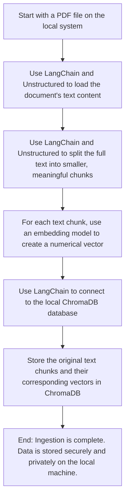

```
▗▄▄▄▖▗▄▄▄▖▗▖  ▗▖▗▄▄▄▖ ▗▖ ▗▖▗▄▄▄▖▗▄▄▖▗▖  ▗▖
▐▌     █  ▐▛▚▖▐▌▐▌ ▐▌ ▐▌ ▐▌▐▌   ▐▌ ▐▌▝▚▞▘  
▐▛▀▀▘  █  ▐▌ ▝▜▌▐▌ ▐▌ ▐▌ ▐▌▐▛▀▀▘▐▛▀▚▖ ▐▌  
▐▌   ▗▄█▄▖▐▌  ▐▌▐▙▄▟▙▖▝▚▄▞▘▐▙▄▄▖▐▌ ▐▌ ▐▌                                      
```


### Key Steps:

1. Upload PDF → Parse with AI → Store in encrypted DB
2. User asks question → AI understands and generates math query
3. RAG used to retrieve information, given to user
4. Final answer with trace is returned to user

---

### Backend

- **Primary Language**: [Python](https://www.python.org/)
- **API Framework**: [Flask](https://flask.palletsprojects.com/)
- **Database ORM**: [SQLAlchemy](https://www.sqlalchemy.org/)
- **Testing Framework**: [pytest](https://docs.pytest.org/)

### Frontend

- **Core Library**: [React JS](https://react.dev/)
- **Build Tool**: [Vite](https://vitejs.dev/)

### Databases

- **Vector Database**: [ChromaDB](https://www.trychroma.com/)
- **Relational Database**: [PostgreSQL](https://www.postgresql.org/)

### AI & Data Processing

- **AI Control Framework**: [LangChain](https://www.langchain.com/)
- **AI Observability Framework**: [LangSmith](https://www.langchain.com/langsmith)
- **PDF Parsing Library**: [Unstructured](https://unstructured.io/)
- **Embedding Model**: [Qwen3-Embedding-0.6B](https://huggingface.co/Qwen/Qwen3-Embedding-0.6B)

---

### Flowchart

This ingestion process may be explained by the following (simplified) flowchart:



---
How Do We Ensure Accurate Retrieval?

The system uses a multi-stage process to ingest, clean, and query documents, ensuring high-quality, relevant context is
retrieved for every query.

1. Use Unstructured's "hi-res" mode to get higher resolution PDFs for our RAG database.
2. Process tables into PDF tables rather than other table formats to preserve structure.
3. Preprocess the PDFs to remove repeat data (ex. headers, footers, links).
4. Chunking is done by separating text and tables. This way the retrieval is more likely to pull relevant text/tables.
5. Chunks have small overlap with each other. This way, titles are preserved.
6. Use a LLM "translation layer" to ensure the RAG queries are using proper keywords (ex. "Consolidated Statements of
   Operations" may not be found from "net income", so we need an AI to clean up queries).
7. Uses a custom component in langchain to parse documents with higher quality using Unstructured directly

### Folder Explanation

- `ingestion`
    - The directory containing all logic related to data ingestion
- `reports`
    - The directory containing all reports to use
- `chromadb`
    - The directory containing the ChromaDB instance
- `testing`
    - The directory containing all pytest tests
- `docs`
    - The folder containing all documentation

---

## See the `docs` folder for flowcharts, prompts, schemas and more specific information.
