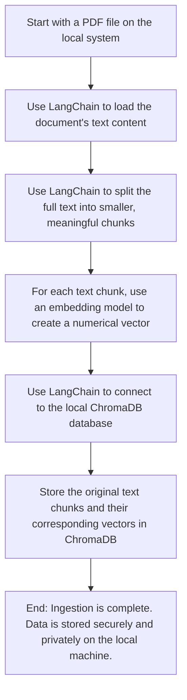

```
▗▄▄▄▖▗▄▄▄▖▗▖  ▗▖▗▄▄▄▖ ▗▖ ▗▖▗▄▄▄▖▗▄▄▖▗▖  ▗▖
▐▌     █  ▐▛▚▖▐▌▐▌ ▐▌ ▐▌ ▐▌▐▌   ▐▌ ▐▌▝▚▞▘  
▐▛▀▀▘  █  ▐▌ ▝▜▌▐▌ ▐▌ ▐▌ ▐▌▐▛▀▀▘▐▛▀▚▖ ▐▌  
▐▌   ▗▄█▄▖▐▌  ▐▌▐▙▄▟▙▖▝▚▄▞▘▐▙▄▄▖▐▌ ▐▌ ▐▌                                      
```


**Key Steps:**

1. Upload PDF → Parse with AI → Store in encrypted DB
2. User asks question → AI understands and generates math query
3. RAG used to retrieve information, given to user
4. Final answer with trace is returned to user

---

**Tech Stack**

- Primary Language, Backend: Python
- AI Framework: LangChain
- API Framework, Backend: Flask
- Test Framework, Backend: pytest
- Embedding Model: Qwen3-Embedding-8B
- Database: ChromaDB
- Frontend: React JS

---
**Flowchart**

This ingestion process may be explained by the following (simplified) flowchart:



---

**Folder Explanation**

- `testing`
    - The directory holding all pytest tests
- `docs`
    - The folder containing all documentation

---

**See the `docs` folder for flowcharts, prompts, schemas and more specific information.**
