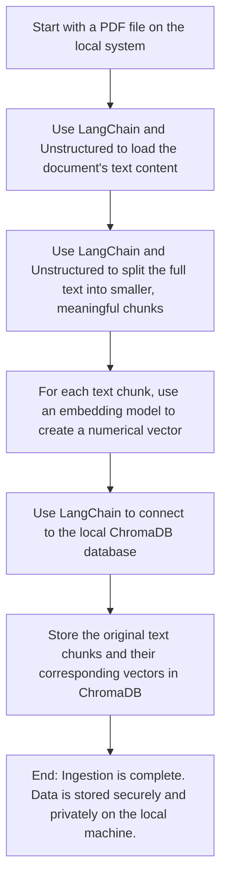

```
▗▄▄▄▖▗▄▄▄▖▗▖  ▗▖▗▄▄▄▖ ▗▖ ▗▖▗▄▄▄▖▗▄▄▖▗▖  ▗▖
▐▌     █  ▐▛▚▖▐▌▐▌ ▐▌ ▐▌ ▐▌▐▌   ▐▌ ▐▌▝▚▞▘  
▐▛▀▀▘  █  ▐▌ ▝▜▌▐▌ ▐▌ ▐▌ ▐▌▐▛▀▀▘▐▛▀▚▖ ▐▌  
▐▌   ▗▄█▄▖▐▌  ▐▌▐▙▄▟▙▖▝▚▄▞▘▐▙▄▄▖▐▌ ▐▌ ▐▌                                      
```


### This is a Monorepo With a New Library in it

### Key Steps:

1. Upload PDF → Parse with AI → Store in encrypted DB
2. User asks question → AI understands and generates math query
3. RAG used to retrieve information, given to user
4. Final answer with trace is returned to user

---

### How to Run FinQuery

#### Backend

1. Go to the `langfuse` folder and execute `docker compose up` in your terminal
2. Go to the `api` folder and run `main.py`

#### Frontend
1. Section in progress

---

### Backend

- **Primary Language**: [Python](https://www.python.org/)
- **API Framework**: [Flask](https://flask.palletsprojects.com/)
- **Database ORM**: [SQLAlchemy](https://www.sqlalchemy.org/)
- **Testing Framework**: [pytest](https://docs.pytest.org/)

### Frontend

- **Core Library**: [React JS](https://react.dev/)
- **Build Tool**: [Vite](https://vitejs.dev/)

### Databases

- **Vector Database**: [ChromaDB](https://www.trychroma.com/)
- **Relational Database**: [PostgreSQL](https://www.postgresql.org/)

### AI & Data Processing

- **AI Control Framework**: [LangChain](https://www.langchain.com/)
- **AI Observability Framework**: [LangFuse](https://github.com/langfuse/langfuse) (locally hosted through Docker)
- **PDF Parsing Library**: [Unstructured](https://unstructured.io/)
- **Embedding Model**: [Qwen3-Embedding-0.6B](https://huggingface.co/Qwen/Qwen3-Embedding-0.6B)

---

### Flowchart

This ingestion process may be explained by the following (simplified) flowchart:


```mermaid
flowchart TD
    A["Start with a PDF file on the local system"] --> B["Use LangChain and Unstructured to load the document's text content"]
    B --> C["Use LangChain and Unstructured to split the full text into smaller, meaningful chunks"]
    C --> D["For each text chunk, use an embedding model to create a numerical vector"]
    D --> E["Use LangChain to connect to the local ChromaDB database"]
    E --> F["Store the original text chunks and their corresponding vectors in ChromaDB"]
    F --> G["End: Ingestion is complete. Data is stored securely and privately on the local machine."]
```

---

### How Do We Ensure Accurate Retrieval?

The system uses a multi-stage process to ingest, clean, and query documents, ensuring high-quality, relevant context is
retrieved for every query.

1. Parsing & Preprocessing
   1. Created a custom component in LangChain with specialized parsing
   2. Use Unstructured's "hi-res" mode to get higher resolution PDFs for our RAG database
   3. Process tables into PDF tables rather than other table formats to preserve structure
   4. Preprocess the PDFs to remove repeat data (ex. headers, footers, links)
2. Chunking
   1. Chunking is done by separating text and tables. This way the retrieval is more likely to pull relevant text/tables.
   2. Chunks have small overlap with each other. This way, titles are preserved
3. Chunk Augmentation
   1. Chunks are augmented with additional metadata like page number, paper title, section title, relevance keywords, and summary
4. Query transformation
   1. Use a LLM "translation layer" to ensure the RAG queries are using proper keywords (ex. "Consolidated Statements of
   Operations" may not be found from "net income", so we need an AI to clean up queries).

[//]: # (5. Multi-Representation Indexing &#40;See: [TowardsDataScience]&#40;https://towardsdatascience.com/multi-rep-colbert-retrieval-models-for-rags-fe05381b8819/&#41;&#41;)
[//]: # (   1. Use a heuristic to determine which tables need MRI)
[//]: # (   2. Use an LLM to generate these "multiple representations" &#40;questions&#41; as additional metadata for the chunks)

### Folder Explanation

- `ingestion`
    - The directory containing all logic related to data ingestion
- `api`
  - The directory containing the API logic and the API itself
- `langfuse`
  - The directory containing the LangFuse GitHub repository (for self hosting purposes)
- `reports`
    - The directory containing all reports to use
- `chromadb`
    - The directory containing the ChromaDB instance
- `testing`
    - The directory containing all pytest tests & playground for experimental features
- `docs`
    - The folder containing all documentation

---

## See the `docs` folder for flowcharts, prompts, schemas and more specific information.

--- 
<details>
<summary>Creation Ethos</summary>

### Articles Used in the Exploring and Improving RAG Methodology:
- Multi-Representation: https://towardsdatascience.com/multi-rep-colbert-retrieval-models-for-rags-fe05381b8819/
- Chunking Considerations: https://towardsdatascience.com/semantic-chunking-for-rag-35b7675ffafd/
- Custom Pipelines: https://towardsdatascience.com/callbacks-and-pipeline-structures-in-langchain-925aa077227e/
- Query Transformation: https://towardsdatascience.com/advanced-query-transformations-to-improve-rag-11adca9b19d1/
- Chunk Augmentation: https://x.com/svpino/status/1940006237384712404
- Embedding Model Choice: https://huggingface.co/spaces/mteb/leaderboard
- Model Choice: https://artificialanalysis.ai/

### Why not use PDF Parsing and Relational Databases (Why Use RAG)?
The files will not all be in standardized formats; this project utilizes SEC filings, but it is made to be expandable, such that if someone were to upload other types of similar financial documents, they would easily be able to still use the tool.

</details>