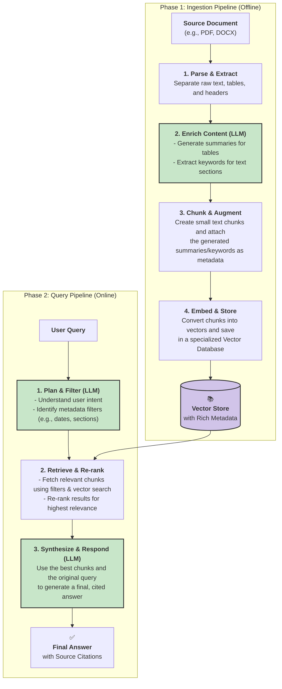
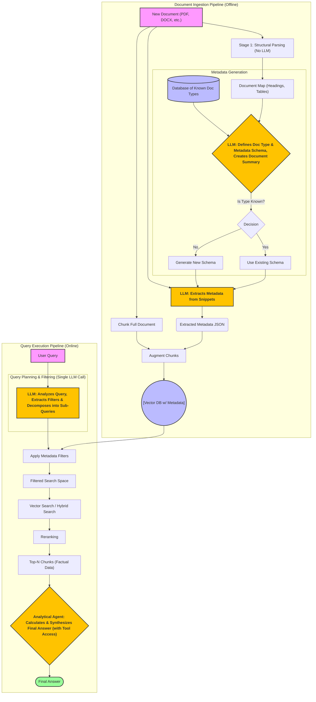

# FinQuery

```
▗▄▄▄▖▗▄▄▄▖▗▖  ▗▖▗▄▄▄▖ ▗▖ ▗▖▗▄▄▄▖▗▄▄▖▗▖  ▗▖
▐▌     █  ▐▛▚▖▐▌▐▌ ▐▌ ▐▌ ▐▌▐▌   ▐▌ ▐▌▝▚▞▘  
▐▛▀▀▘  █  ▐▌ ▝▜▌▐▌ ▐▌ ▐▌ ▐▌▐▛▀▀▘▐▛▀▚▖ ▐▌  
▐▌   ▗▄█▄▖▐▌  ▐▌▐▙▄▟▙▖▝▚▄▞▘▐▙▄▄▖▐▌ ▐▌ ▐▌
```


**An advanced, full-stack RAG application for querying complex financial documents using local-first AI models.**

FinQuery is a full-stack application designed for semantic search and question-answering on complex financial documents. It leverages a local-first Retrieval-Augmented Generation (RAG) pipeline, which can ensure privacy while maintaining performance. By combining multistep parsing with a multi-stage retrieval process, FinQuery delivers accurate, context-aware answers from dense technical texts.

## Key Features

- **Local-First Architecture**: All AI processing happens on your machine with complete data privacy
- **Advanced RAG Techniques**: Multi-stage retrieval with semantic chunking, chunk augmentation, and cross-encoder reranking
- **Comprehensive Observability**: Full tracing with self-hosted Langfuse for debugging and optimization
- **Modular Monorepo Design**: Clean separation between reusable parsing library and main application
- **Financial Document Expertise**: Specialized parsing for complex financial documents with sophisticated table handling

## Tech Stack

### Backend
- **Language**: [Python 3.13](https://www.python.org/downloads/release/python-3130/)
- **API Framework**: [Flask](https://flask.palletsprojects.com/) 
- **AI Framework**: [LangChain](https://www.langchain.com/)
- **Observability**: [LangFuse](https://langfuse.com/)
- **Testing**: [pytest](https://docs.pytest.org/en/stable/)

### Frontend
- **Core**: [React 19](https://react.dev/blog/2024/04/25/react-19)
- **Build Tool**: [Vite](https://vitejs.dev/)

### Databases
- **Vector Store**: [ChromaDB](https://www.trychroma.com/)
- **Record Management**: [PostgreSQL](https://www.postgresql.org/)

### AI & Data Processing
- **PDF Parsing**: [Docling](https://docling-project.github.io/docling/)
- **Embedding Model**: [Qwen/Qwen3-Embedding-0.6B](https://huggingface.co/Qwen/Qwen3-Embedding-0.6B)
- **High-Fidelity Generation**: [qwen3-14b](https://huggingface.co/Qwen/Qwen3-14B)
- **Utility Generation**: [qwen3-30b-a3b-mixed-3](https://huggingface.co/mlx-community/Qwen3-30B-A3B-mixed-3-4bit) 
- **Reranking Model**: [Qwen/Qwen3-Reranker-0.6B](https://huggingface.co/Qwen/Qwen3-Reranker-0.6B)

## Prerequisites

- Python 3.11+
- Docker and Docker Compose
- Active Python virtual environment
- System dependency: `tesseract-ocr`
- **LM Studio or compatible API server running locally** (for AI model inference)

## Quick Start

### 1. Clone & Setup Environment
```bash
git clone https://github.com/ltmerletti/FinQuery2.git
cd FinQuery2

# Move and configure environment variables
mv docs/.env.example .env
# Edit .env with your configuration
```

### 2. Install Dependencies
```bash
# Activate the virtual environment
source .venv/bin/activate

# Install the parser library
pip install -e packages/finquery_parser

# Install the main application
pip install -e packages/finquery_app

# Install frontend dependencies
cd packages/finquery_frontend
npm install

# Initialize the database
cd ../../packages/finquery_app/src/finquery_app/database
python database_setup.py
```

### 3. Start Services

**Terminal 1: Langfuse**
```bash
docker-compose up -d
# Access at http://localhost:3000
```

**Terminal 2: Flask Backend**
```bash
python packages/finquery_app/src/finquery_app/api/main.py
# Access at http://localhost:5001
```

**Terminal 3: Frontend**
```bash
cd packages/finquery_frontend
npm run dev
```

## System Architecture
Simplified Full Pipeline 

```mermaid
flowchart TD
    %% --- Subgraphs for Organization ---
    subgraph "Phase 1: Ingestion Pipeline (Offline)"
        direction LR
        A["<b>Source Document</b> <br/>(e.g., PDF, DOCX)"] --> B;
        B["<b>1. Parse & Extract</b><br/>Separate raw text, tables, and headers"] --> C;
        C["<b>2. Enrich Content (LLM)</b><br/>- Generate summaries for tables<br/>- Extract keywords for text sections"] --> D;
        D["<b>3. Chunk & Augment</b><br/>Create small text chunks and attach<br/>the generated summaries/keywords as metadata"] --> E;
        E["<b>4. Embed & Store</b><br/>Convert chunks into vectors and save<br/>in a specialized Vector Database"] --> F[("📚 <br/> <b>Vector Store</b><br/>with Rich Metadata")];
    end

    subgraph "Phase 2: Query Pipeline (Online)"
        direction LR
        Q1["<b>User Query</b>"] --> Q2;
        Q2["<b>1. Plan & Filter (LLM)</b><br/>- Understand user intent<br/>- Identify metadata filters (e.g., dates, sections)"] --> Q3;
        F --> Q3;
        Q3["<b>2. Retrieve & Re-rank</b><br/>- Fetch relevant chunks using filters & vector search<br/>- Re-rank results for highest relevance"] --> Q4;
        Q4["<b>3. Synthesize & Respond (LLM)</b><br/>Use the best chunks and the original query<br/>to generate a final, cited answer"] --> Q5["✅ <br/> <b>Final Answer</b><br/>with Source Citations"];
    end

    %% --- Styling ---
    classDef llmNode fill:#C8E6C9,stroke:#333,stroke-width:2px;
    class C,Q2,Q4 llmNode;
    style F fill:#D1C4E9,stroke:#333,stroke-width:2px; 
```
    
Full-Detail Ingestion Process

```mermaid
flowchart TD
    %% Styling
    classDef process fill:#E3F2FD,stroke:#333,stroke-width:2px;
    classDef decision fill:#FFF9C4,stroke:#333,stroke-width:2px,stroke-dasharray: 5 5;
    classDef datastore fill:#D1C4E9,stroke:#333,stroke-width:2px;
    classDef model fill:#C8E6C9,stroke:#333,stroke-width:2px;
    classDef io fill:#FFCCBC,stroke:#333,stroke-width:2px;
    classDef subgraphStyle fill:#FAFAFA,stroke:#BDBDBD,stroke-width:2px;

    %% --- Start of Pipeline ---
    A["Start: PDF Files in Source Directory"] --> B{"Find New Files"};
    class A,B io;

    B --> C["Run Ingestion Process"];
    class C process;

    subgraph "Ingestion Process (Per-File Loop)"
        direction TB

        %% --- Stage 1: Conversion & Cleaning ---
        subgraph "PDF to Markdown Conversion"
            D["CustomPDFLoader"] --> E["Convert PDF to Markdown (docling)"];
            E --> F{"PDF Complexity?"};
            F -- "Tricky PDF" --> G["Use XLARGE Layout Model & Full OCR"];
            F -- "High-Res" --> H["Use LARGE Layout Model"];
            F -- "Default" --> I["Standard Layout Model"];
            G & H & I --> J["Clean Markdown Artifacts"];
        end

        %% --- Stage 2: Parsing & Element Separation ---
        subgraph "Parse & Separate Elements"
            J --> K["Parse Cleaned Markdown"];
            K --> L["Identify Text Blocks"];
            K --> M["Identify Table Blocks"];
            L -- "Find Potential Prefaces" --> N{"Is text block a preface for a table?"};
            N -- Yes --> O["Associate Preface with Table"];
            N -- No --> P([Text Elements]);
            M & O --> Q([Table Elements]);
        end

        %% --- Stage 3: Parallel Processing of Elements ---
        subgraph "Text Element Processing"
            P --> P1["Batch Extract Keywords (spaCy)"];
            P1 --> P2["Content-Aware Chunking (max 256 tokens)"];
            P2 --> P3["Merge small consecutive chunks (over 175 tokens)"];
            P3 --> R_Text["Create Augmented Text Chunks"];
        end

        subgraph "Table Element Processing"
            Q --> Q1["Batch Extract Keywords (spaCy)"];
            Q1 --> Q2["Generate 1-Sentence Summary (ChatOpenAI LLM)"];
            Q2 --> R_Table["Create Augmented Table Chunks"];
        end
        
        %% --- Document Level Summary (in parallel) ---
        J & R_Table -- "MD Headers & Table Summaries" --> DS1["Generate High-Level Document Summary (small_llm)"]
        DS1 --> DS2["Save Document Summary to TXT File"]
        class DS1 model
        class DS2 io

        %% --- Stage 4: Unification & Indexing ---
        subgraph "Unification, Indexing & Storage"
            R_Text & R_Table --> S["Combine all chunks"];
            S --> T["Filter out small chunks (under 200 chars)"];
            T --> U["Index Documents (langchain.indexes.index)"];
            U --> V{"Check for existing chunk ID (SQLRecordManager)"};
            V -- "No / Changed" --> W["Generate Embeddings (Embedding Model)"];
            W --> X["Write to Vector Store (ChromaDB)"];
            V -- "Yes / Unchanged" --> Y["Skip Indexing"];
            X & Y --> Z["Update Record Manager"];
        end

        %% --- Stage 5: Finalization ---
        subgraph "Finalization"
            Z --> Z1["Move Processed PDF to 'added' directory"];
        end
        
        class D,E,J,K,P1,P2,P3,Q1,Z,Z1 process;
        class F,N,V decision;
        class G,H,I,Q2,W model;
        class L,M,P,Q,R_Text,R_Table,S,T,U datastore;
    end

    %% Connects process step to the first node IN the subgraph
    C --> D; 
    
    Z1 --> Z_End("End of Process");
    class Z_End io;
```

Full-Detail Retrieval

```mermaid
flowchart TD
 subgraph subGraph0["Metadata Generation"]
        D{"LLM: Defines Doc Type &amp; Metadata Schema, Creates Document Summary"}
        D_DB[("Database of Known Doc Types")]
        C["Document Map (Headings, Tables)"]
        E{"Decision"}
        F["Generate New Schema"]
        G["Use Existing Schema"]
  end
 subgraph subGraph1["Document Ingestion Pipeline (Offline)"]
        B["Stage 1: Structural Parsing (No LLM)"]
        A["New Document (PDF, DOCX, etc.)"]
        subGraph0
        H["LLM: Extracts Metadata from Snippets"]
        I("Extracted Metadata JSON")
        J["Chunk Full Document"]
        K["Augment Chunks"]
        L(("[Vector DB w/ Metadata]"))
  end
 subgraph subGraph2["Query Planning & Filtering (Single LLM Call)"]
        N["LLM: Analyzes Query, Extracts Filters & Decomposes into Sub-Queries"]
  end
 subgraph subGraph3["Query Execution Pipeline (Online)"]
        M["User Query"]
        subGraph2
        Q["Apply Metadata Filters"]
        R["Filtered Search Space"]
        S["Vector Search / Hybrid Search"]
        T["Reranking"]
        U["Top-N Chunks (Factual Data)"]
        V{"Analytical Agent: Calculates & Synthesizes Final Answer (with Tool Access)"}
        W(["Final Answer"])
  end
    A --> B & H & J
    B --> C
    D_DB --> D
    C --> D
    D -- Is Type Known? --> E
    E -- No --> F
    E -- Yes --> G
    F --> H
    G --> H
    H --> I
    J --> K
    I --> K
    K --> L
    M --> N
    N --> Q
    L --> Q
    Q --> R
    R --> S
    S --> T
    T --> U
    U --> V
    V --> W

     D:::llmCall
     H:::llmCall
     N:::llmCall
     V:::llmCall
    classDef llmCall fill:#ffc300,stroke:#333,stroke-width:2px,font-weight:bold
    style A fill:#f9f,stroke:#333,stroke-width:2px
    style D_DB fill:#bbf,stroke:#333,stroke-width:2px
    style L fill:#bbf,stroke:#333,stroke-width:2px
    style M fill:#f9f,stroke:#333,stroke-width:2px
    style W fill:#9f9,stroke:#333,stroke-width:2px
```

## How We Ensure Accurate Retrieval

### Custom Parsing Pipeline
- Custom LangChain component with specialized financial document parsing
- Customized Docling parsing for high-res, accurate tables
- Preprocessing removes repetitive elements (headers, footers, pagination)
- Tables preserved in structured Markdown format

### Specialized Chunking Strategy
- Separate chunking approaches for text content versus tabular data
- Strategic overlap between chunks to preserve semantic context
- Chunk sizes optimized for both retrieval performance and context preservation

### Chunk Augmentation
- AI-generated metadata including relevance keywords and summaries
- Enhanced searchability through multiple representation vectors
- Page numbers, section titles, and document hierarchy preserved

### Cross-Encoder Reranking
- Qwen/Qwen3-Reranker-0.6B model reranks initial retrieval results
- Significant improvement in relevance ranking over semantic similarity alone
- Reduces noise from tangentially related content

## Project Structure

```
FinQuery2/
├── packages/
│   ├── finquery_parser/     # Reusable PDF parsing library
│   ├── finquery_app/        # Main Flask application
│   └── finquery_frontend/   # React frontend
├── chromadb/               # Vector database storage
├── reports/                # Sample documents
└── docs/                   # Documentation & schemas
```

This monorepo structure ensures that code is reused and there is a clear separation of concerns:
- **finquery_parser**: Self-contained, reusable library for PDF parsing
- **finquery_app**: Main Flask application with RAG implementation
- **finquery_frontend**: React-based user interface

## Future Roadmap

- [x] **Advanced Table Parsing**: Rewrite logic to have more advanced and accurate table parsing
- [x] **Hybrid Chunking Strategy**: Formal separation of text vs table chunking
- [x] **Table Context Modifications**: Change the one-line summary to be longer with more specifics, and include more keywords extracted for each table to have higher semantic density
- [x] **Contextual Retrieval**: Look into [Anthropic's contextual retrieval](https://www.anthropic.com/news/contextual-retrieval) strategy
- [x] **Evaluation Framework**: Further customize LangFuse for better observability
- [ ] **MLX Adapter**: Finalize MLX adapter and embedding models for higher efficiency on Apple Silicon
- [ ] **Document Summarization**: Finalize document summarization functionality for better format
- [ ] **Initialize Database**: Set up PostgreSQL db for metadata and document types
- [ ] **Implement Advanced Metadata Capturing**: Implement and finalize logic to extract metadata and augment chunks with it
- [ ] **Implement Filtering System**: Implement filtering system for data
- [ ] **Create LLM Chatbot**: Create the chatbot for direct user interface
- [ ] **Update API & Frontend**: Update the API and frontend to fit better

## Documentation

See the `docs/` folder for:
- Detailed flowcharts
- Prompt templates
- Database schemas
- API documentation
- Performance benchmarks

## Testing

```bash
# Run the test suite
pytest
```

## Design Philosophy

**Why RAG over Traditional Parsing?**

Financial documents come in non-standardized formats. While this project includes SEC filings, it's designed to be expandable for any type of financial document. RAG provides the flexibility to handle varied document structures while maintaining high accuracy.

**Local-First Approach**

Privacy is paramount when dealing with financial data. FinQuery runs entirely on your local machine, ensuring sensitive documents never leave your control while still providing enterprise-grade AI capabilities.

---

<details>
<summary>Research & Methodology</summary>

### Articles Used in Exploring and Improving RAG Methodology:
- **Multi-Representation**: https://towardsdatascience.com/multi-rep-colbert-retrieval-models-for-rags-fe05381b8819/
- **Chunking Considerations**: https://towardsdatascience.com/semantic-chunking-for-rag-35b7675ffafd/
- **Custom Pipelines**: https://towardsdatascience.com/callbacks-and-pipeline-structures-in-langchain-925aa077227e/
- **Query Transformation**: https://towardsdatascience.com/advanced-query-transformations-to-improve-rag-11adca9b19d1/
- **Chunk Augmentation**: https://x.com/svpino/status/1940006237384712404
- **Embedding Model Choice**: https://huggingface.co/spaces/mteb/leaderboard
- **Model Choice**: https://artificialanalysis.ai/
- **Best of 18 RAG Techniques**: https://levelup.gitconnected.com/testing-18-rag-techniques-to-find-the-best-094d166af27f#4630

### Why not use PDF Parsing and Relational Databases (Why Use RAG)?
The files will not all be in standardized formats; this project utilizes SEC filings, but it is made to be expandable, such that if someone were to upload other types of similar financial documents, they would easily be able to still use the tool.

</details>